# DBMS

---

## Lab 1: Basic Table and Database Setup
In this lab, I created a basic database named `college` and a `students` table. I added columns for student details (ID, name, address, email) and inserted a few records to test it.

* **File:** [Lab 1.sql](./Lab1.sql)

### Table Structure
* `s_id`: Integer, primary key, auto-increment.
* `f_name`: First name (text).
* `l_name`: Last name (text).
* `address`: Address (text).
* `email`: Unique email.

### Output Screenshot
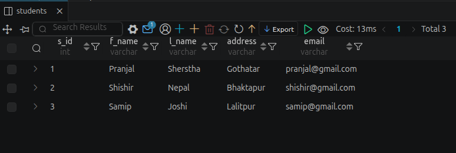

---

## Lab 2 & 3 & 4: Advanced SQL Queries and Joins
This lab was about setting up a relational database with three connected tables (Students, Courses, and Enrollment) and writing queries to manipulate and join the data.

* **File:** [Lab 2 & 3 & 4.sql](./Lab_2-3-4.sql)

### Database Relationships
* A student can enroll in multiple courses.
* An enrollment table connects students (`student_id`) to courses (`course_id`) using foreign keys.

---

## Query Output Screenshots

### Part 1: Schema Setup Verification

#### Students Table (Initial Select)

#### Courses Table (Initial Select)
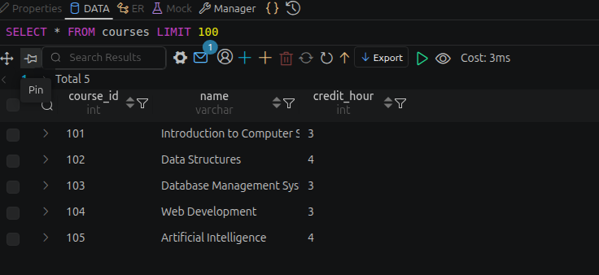

#### Enrollment Table (Initial Select)
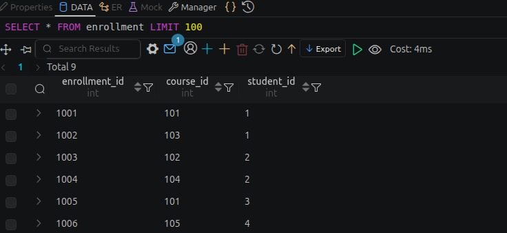

---

### Part 2: Basic Selection and Filtering

#### Question 1: Retrieve all records and columns from the Students table
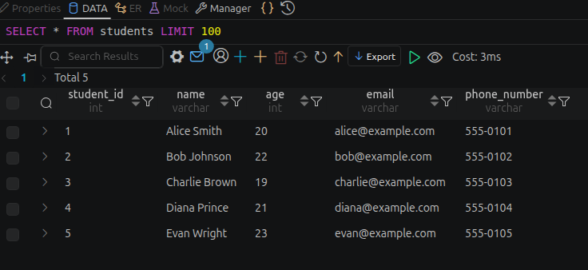

#### Question 2: List only the name and email of all students
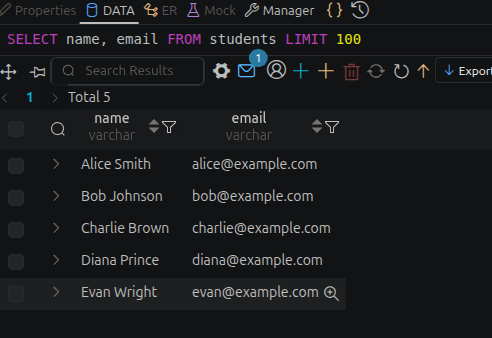

#### Question 3: Find all students who are strictly older than 20 years
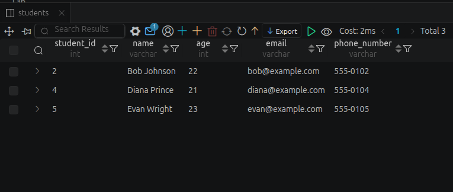

#### Question 4: Retrieve the names of students whose name starts with the letter 'A'
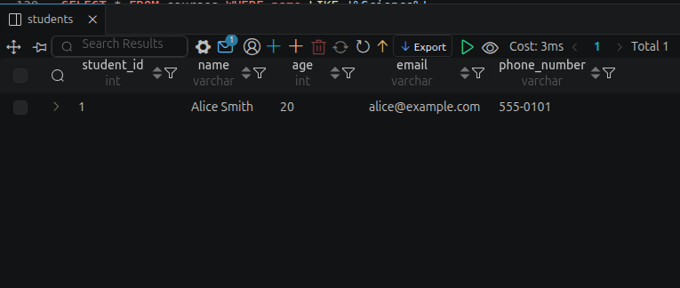

#### Question 5: Find all courses that have the word 'Science' anywhere in their name
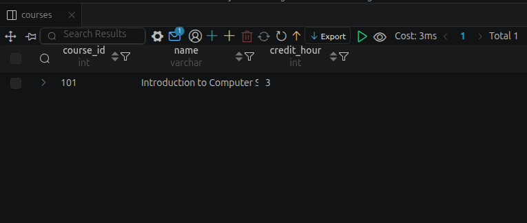

#### Question 6: List all students sorted by their age in descending order
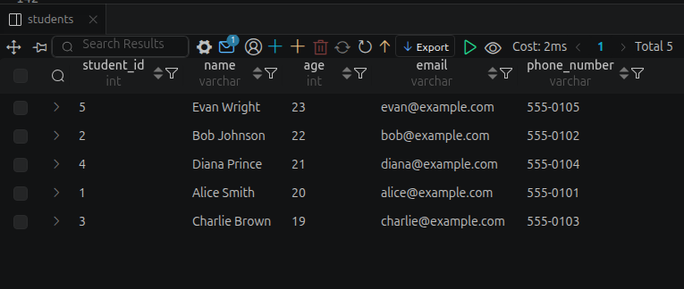

#### Question 7: Retrieve the details of the student with the exact phone number '555-0103'
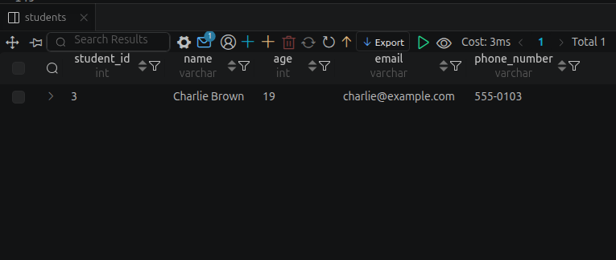

---

### Part 3: CRUD Operations — ALTER (Modifying Table Structures)

#### Question 1: Add a Column (address VARCHAR(255)) to the Students table
#### Question 2: Add a Column with Default (is_active BOOLEAN DEFAULT TRUE) to the Students table
#### Question 3: Modify a Column Data Type (phone_number to VARCHAR(50))
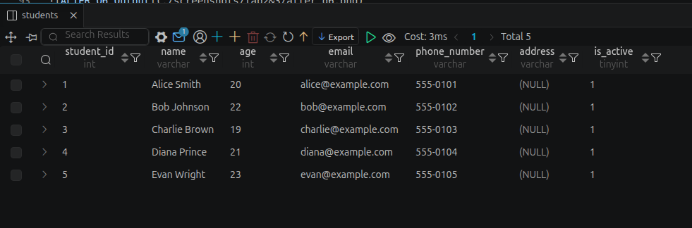

#### Question 4: Rename a Column (name in courses table to course_name)
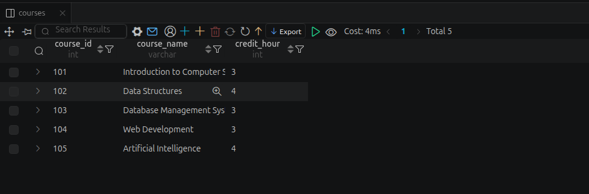

#### Question 5: Drop a Column (remove the age column from the Students table)
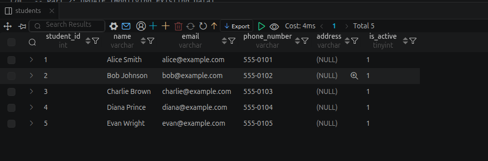

#### Question 6: Add a Constraint (ensure credit_hour in courses is never less than 1)
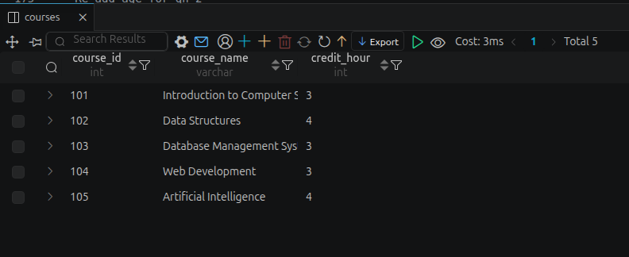

---

### Part 4: CRUD Operations — UPDATE (Modifying Existing Data)

#### Question 7: Simple Update (Update Alice Smith's phone_number to '555-9999')
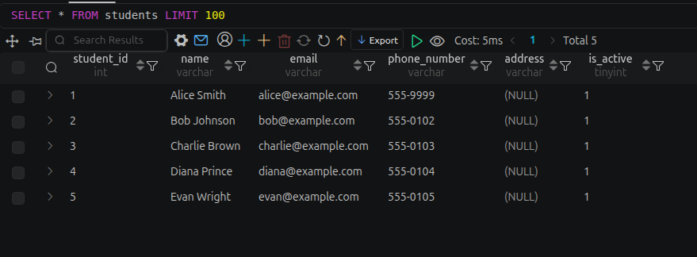

#### Question 8: Update Multiple Columns (Update Bob Johnson's age to 23 and email to 'bob.j@newmail.com')
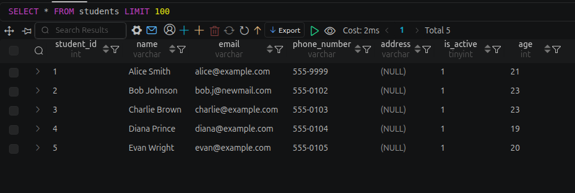

#### Question 9: Conditional Update (Add 1 to credit_hour of any course with exactly 3 credits)
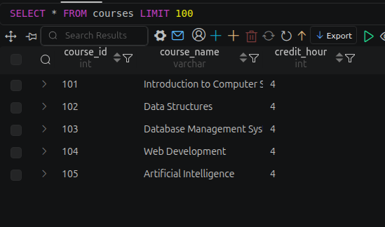

#### Question 10: Bulk Update with String Function (Convert all student emails to completely lowercase)
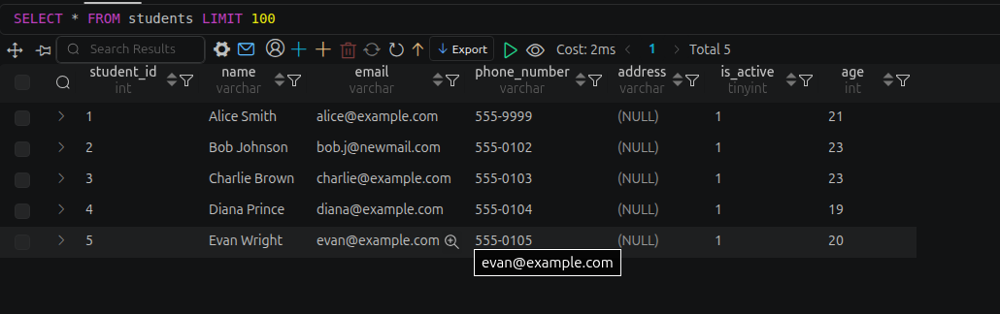

#### Question 11: Update with a Subquery (Update credit_hour of 'Data Structures' to 5 by looking up its name)
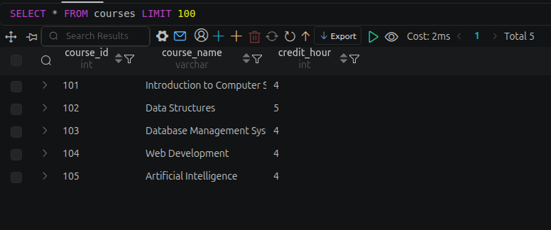

---

### Part 5: CRUD Operations — DELETE (Removing Data)

#### Question 12: Simple Delete (Delete student named 'Evan Wright')
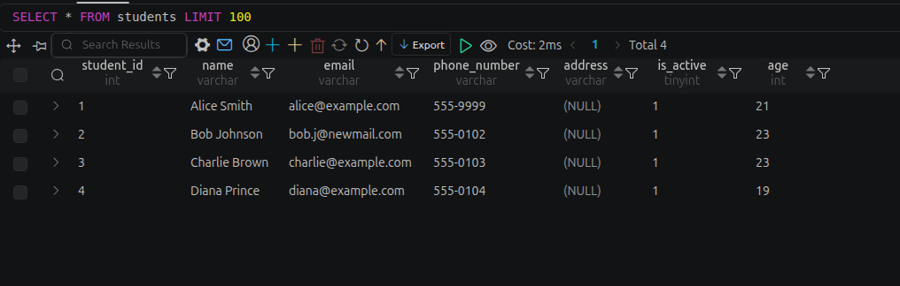

#### Question 13: Delete with Condition (Delete any course with fewer than 3 credit_hours)
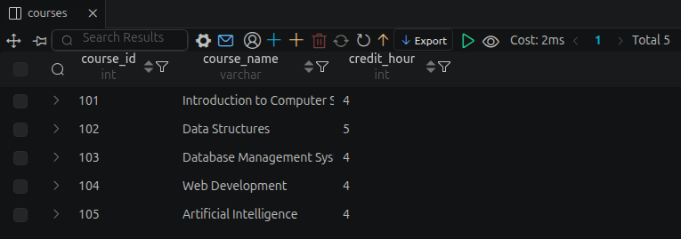

#### Question 14: Delete Related Records (Remove Charlie Brown's enrollments then delete his student record)
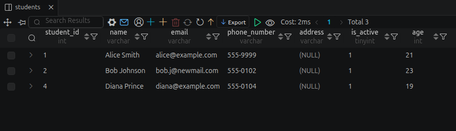

#### Question 15: Clear a Table (Delete all records from the enrollment table)
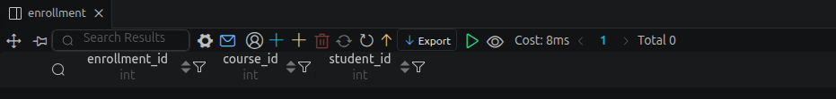

---

### Part 6: Aggregate Functions

#### Question 8: Count the total number of students currently in the database
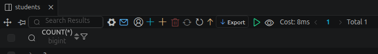

#### Question 9: Calculate the average age of all students
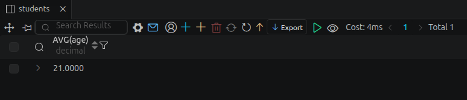

#### Question 10: Find the maximum credit hours offered by any single course
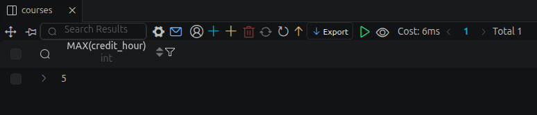

#### Question 11: Find the age of the youngest student in the database
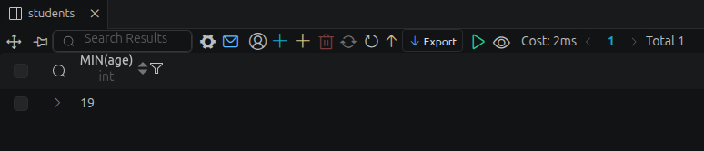

#### Question 12: Calculate the total sum of credit hours for all available courses combined
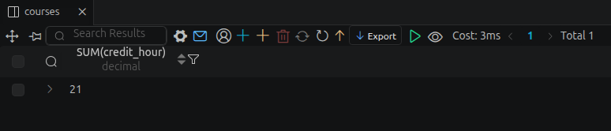

---

### Part 7: Grouping Data

#### Question 13: Count how many students are enrolled in each course
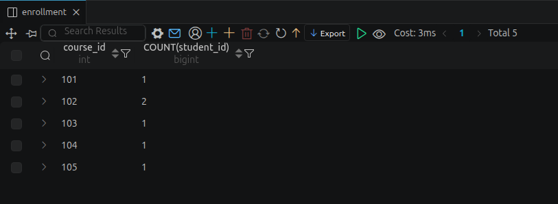

#### Question 14: Find the total number of courses each student is enrolled in
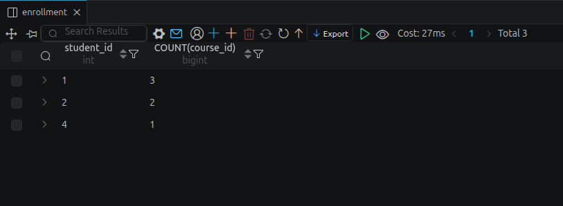

#### Question 15: List the course_ids of courses that have more than 2 students enrolled (HAVING)
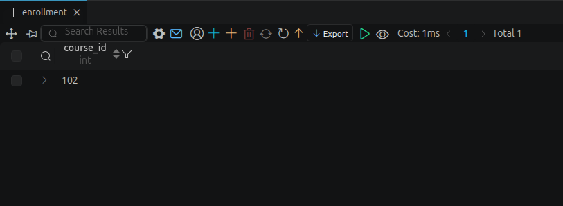

#### Question 16: Find the student_ids of students who are enrolled in exactly 2 courses
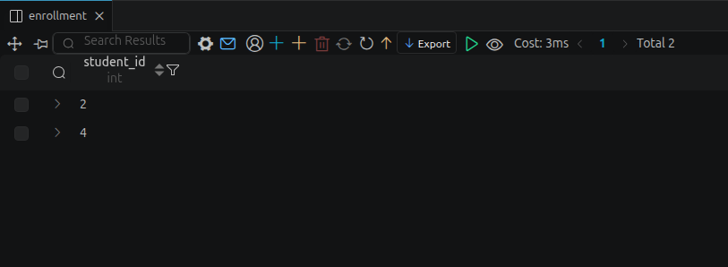

---

### Part 8: Table Relations and Joins

#### Question 17: Display the name of each student alongside the course_ids they are enrolled in
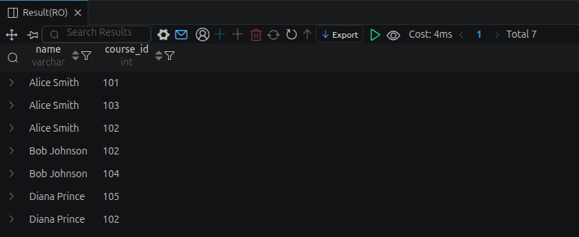

#### Question 18: Retrieve the names of students and the names of the courses they are enrolled in
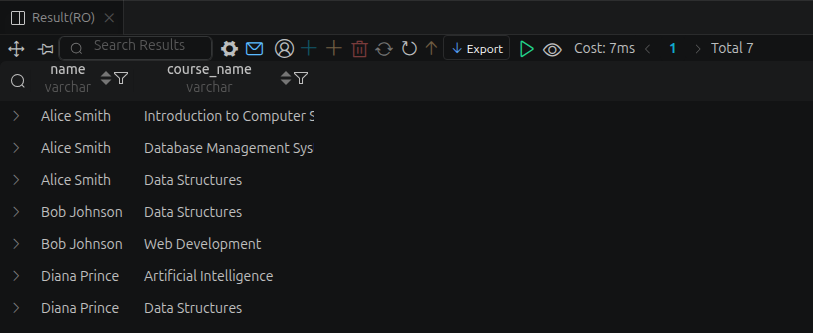

#### Question 19: List all courses and the number of students enrolled (including courses with zero students)
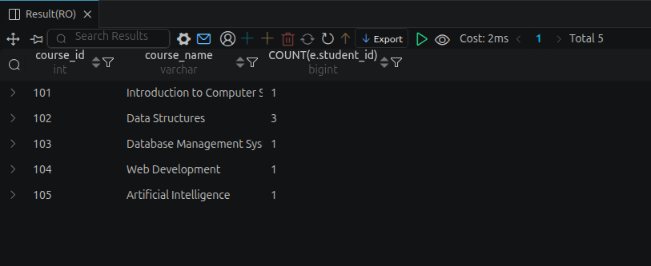

#### Question 20: Find the names of all students who are actively taking 'Database Management Systems'
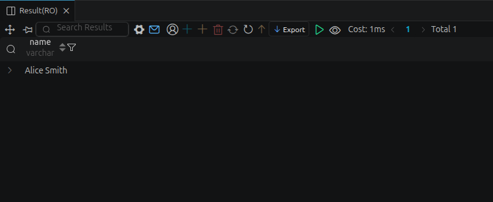

#### Question 21: Identify any students who are not enrolled in any course
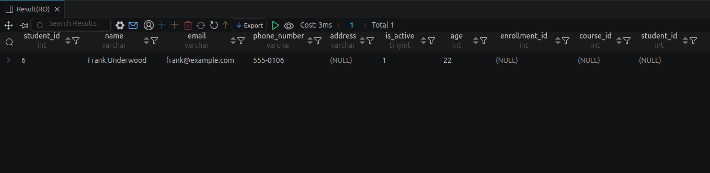

#### Question 22: Calculate the total credit hours each student is currently taking
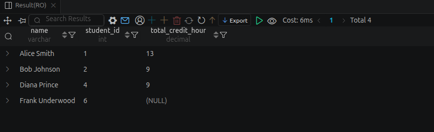

---

### Part 9: Subqueries and Advanced Logic

#### Question 23: Find the names of students enrolled in the course with the highest credit hours
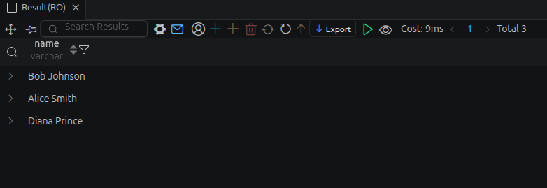

#### Question 24: List courses with enrollment counts higher than the average enrollment count across all courses
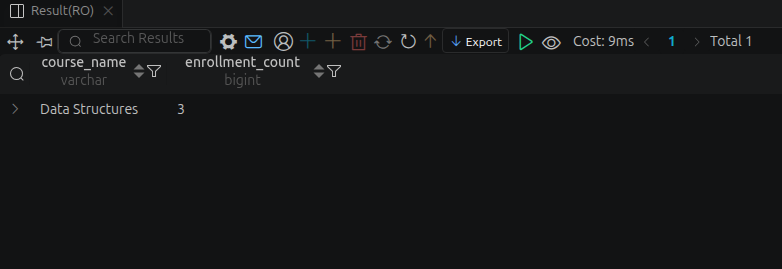

#### Question 25: Find the names of students whose age is strictly greater than the average age
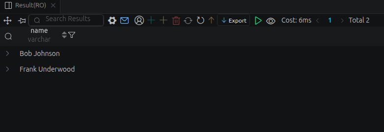

---

### Part 10: Stored Procedures and DML

#### Question 26: Stored Procedure GetStudentCourses execution
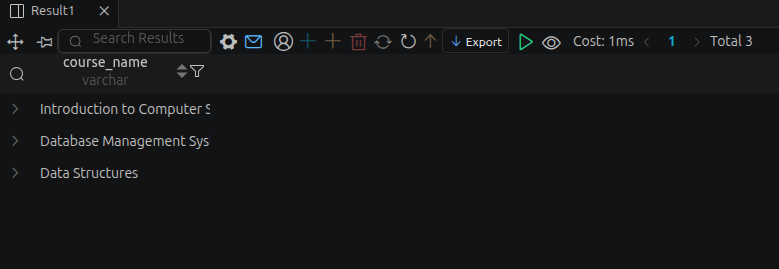

#### Question 27: Stored Procedure EnrollStudent execution
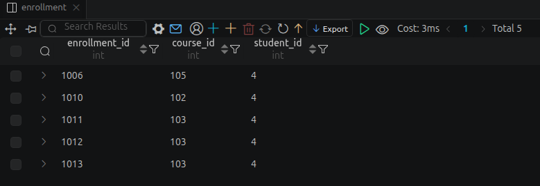

#### Question 28: UPDATE statement to increase the credit hours of 'Web Development' by 1
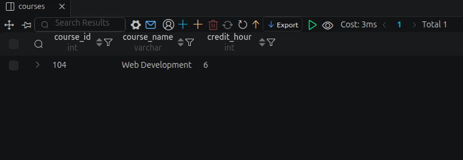

---

## Lab 5: User creation & drop & permission grant & revoke
This lab was about user creation, user drop, granting and revoking database access permissions.

* **File:** [Lab 5.sql](./Lab5.sql)

.png)

.png)

.png)

---

## Lab 6: Role creation & drop & permission grant & revoke
This lab was about role creation, role drop, role set to users, granting and revoking database access permissions to roles.

* **File:** [Lab 6.sql](./Lab6.sql)

.png)

.png)

.png)

.png)

